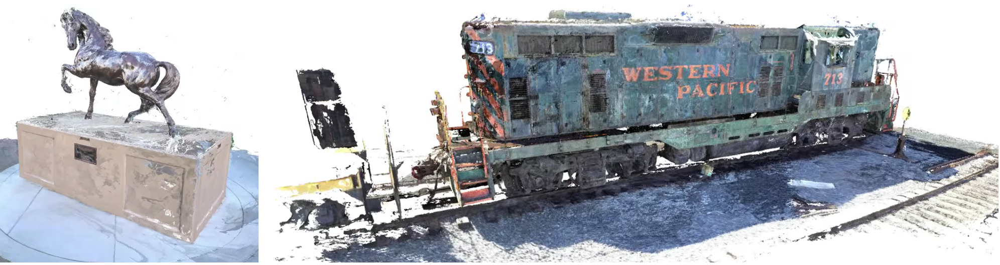
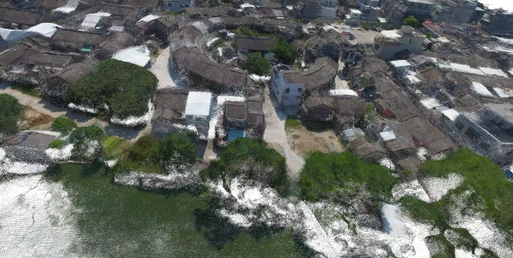
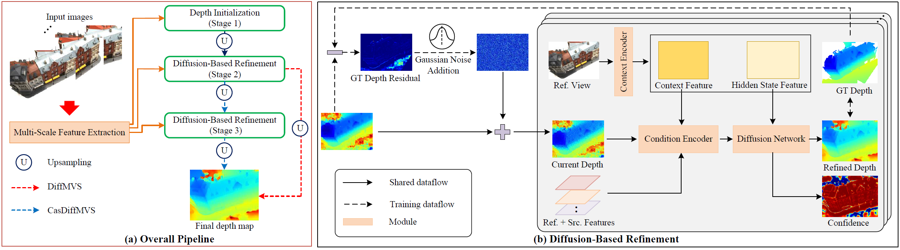
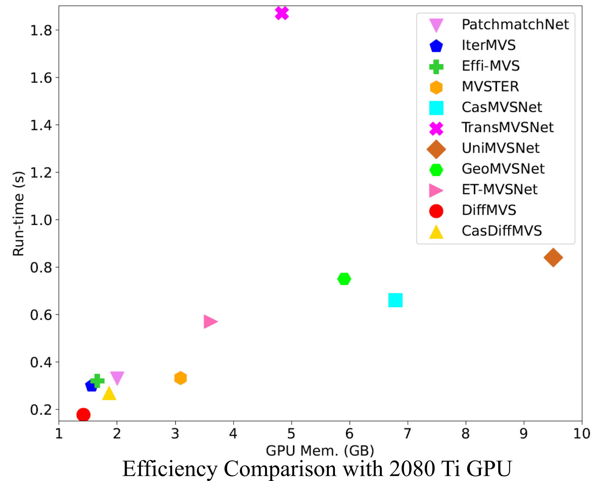
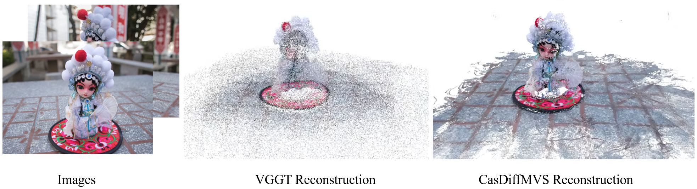

<div align="center">
<h1>Lightweight and Accurate Multi-View Stereo with Confidence-Aware Diffusion Model</h1>

<a href="https://fangjinhuawang.github.io/data/DiffMVS.pdf" target="_blank" rel="noopener noreferrer"></a>
<a href="https://ieeexplore.ieee.org/abstract/document/11120351"></a>


[Fangjinhua Wang](https://fangjinhuawang.github.io/), [Qingshan Xu](https://ghixu.github.io/), [Yew-Soon Ong](https://personal.ntu.edu.sg/asysong/home.html), [Marc Pollefeys](https://people.inf.ethz.ch/marc.pollefeys/)
</div>




```
@article{wang2025lightweight,
  title={Lightweight and Accurate Multi-View Stereo With Confidence-Aware Diffusion Model},
  author={Wang, Fangjinhua and Xu, Qingshan and Ong, Yew-Soon and Pollefeys, Marc},
  journal={IEEE Transactions on Pattern Analysis and Machine Intelligence},
  year={2025},
  publisher={IEEE}
}
```

## Introduction
There always exists tradeoff between accuracy and efficiency. To find a better balance between quality and computation, we introduce diffusion model in Multi-View Stereo (MVS) for efficient and accurate reconstruction, and propose two methods, named DiffMVS and CasDiffMVS. Because of the high efficiency, impressive performance and lightweight structure, we hope that our methods can serve as new strong baselines for future research in MVS. 

Specifically, we estimate a coarse initial depth map and refine it with a conditional diffusion model. 
Diffusion model learns depth prior and uses random noise to avoid local minima. 
Different from other diffusion models that start from pure random noise, we refine a coarse depth map with diffusion model, which explicitly reduces the sampling steps and increases stability w.r.t. random seeds. 
In addition, we design a lightweight diffusion network to improve both performance and efficiency. 



We compare the efficiency with previous methods on a same workstation with NVIDIA 2080Ti GPU and summarize the results as follows.




## Quick Start
First, clone this repository and install the dependencies. 

```
git clone https://github.com/cvg/diffmvs.git
cd diffmvs
pip install -r requirements.txt
```

Next, download [checkpoints](https://drive.google.com/file/d/1GUpNJlxwcLyyYW622d3Jso0qdEP6LGx5/view?usp=sharing) and unzip them.


## Demo
Try the models with your images. First, place the images under `images` folder. 
```
SCENE_DIR/
├── images/
```

### Sparse reconstruction
We support [VGGT](https://github.com/facebookresearch/vggt) and [COLMAP](https://github.com/colmap/colmap) to estimate camera poses and reconstruct sparse point cloud. 


**VGGT**. We suggest creating a new conda environment for VGGT because the default version of Pytorch is different. 

```
git clone git@github.com:facebookresearch/vggt.git
cd vggt
pip install -r requirements.txt
pip install -r requirements_demo.txt

python vggt/demo_colmap.py --scene_dir="/SCENE_DIR"
```

**COLMAP**. Follow [wiki](https://colmap.github.io/tutorial.html#structure-from-motion) to get sparse reconstruction. The easiest way is to use COLMAP's GUI and run automatic reconstruction. 

### Data Conversion
Back to our codebase, we need to transform the data from COLMAP format to the format that we use for DTU, Tanks & Temples, and ETH3D. 

**VGGT**. Though VGGT exports the output directly to COLMAP format, there exists difference. For example, each 3D point from VGGT corresponds to a single pixel, while that from COLMAP may corresponds to multiple keypoints in multiple images. Therefore, it is not suitable to follow [MVSNet](https://arxiv.org/pdf/1804.02505) and use common 3D track to compute view score for co-visibility. 

Here, we use the similarity of image retrieval features to estimate co-visibility between different images. Download pretrained model [CVPR23_DeitS_Rerank.pth](https://drive.google.com/drive/folders/14dkj0o0NpAD_1MB0Kqt7NiGxR5ekOdN_?usp=sharing) from [R2Former](https://github.com/bytedance/R2Former). Then we can run:

```
python colmap_input.py --input_folder="/SCENE_DIR" --output_folder="/SCENE_DIR/mvs" --VGGT --checkpoint="/R2FORMER_CKPT"
```

**COLMAP**
```
python colmap_input.py --input_folder="/SCENE_DIR" --output_folder="/SCENE_DIR/mvs"
```

After conversion, the directory looks like:
```
SCENE_DIR/
├── images/
└── sparse/
    ├── cameras.bin
    ├── images.bin
    └── points3D.bin
└── mvs/
    ├── images/
    ├── cams/
    └── pair.txt
```

### Dense Reconstruction
Next, we can estimate the depth maps and fuse them into a point cloud with our methods. Take CasDiffMVS for example:

```
MVS_DIR="/SCENE_DIR/mvs"
CKPT_FILE="./checkpoints/casdiffmvs_blend.ckpt"
OUT_DIR='./outputs_demo'
if [ ! -d $OUT_DIR ]; then
    mkdir -p $OUT_DIR
fi

python test.py --dataset=general --batch_size=1 --num_view=7 --method=casdiffmvs --save_depth \
    --testpath=$MVS_DIR  --numdepth_initial=48 --numdepth=384 \
    --loadckpt=$CKPT_FILE --outdir=$OUT_DIR \
    --scale 0.0 0.125 0.025 --sampling_timesteps 0 1 1 --ddim_eta 0 1 1 \
    --stage_iters 1 3 3 --cost_dim_stage 4 4 4 --CostNum 0 4 4 \
    --hidden_dim 0 32 20 --context_dim 32 32 16 --unet_dim 0 16 8 \
    --min_radius 0.125 --max_radius 8 \
    --geo_pixel_thres 0.125 --geo_depth_thres 0.01 --geo_mask_thres 2 \
    --photo_thres 0.3 0.5 0.5
```

Note that you may want to tune hyperparameters for post-processing, i.e. `geo_pixel_thres, geo_depth_thres, geo_mask_thres, photo_thres`, to get the best reconstruction quality. `geo_pixel_thres, geo_depth_thres, geo_mask_thres` are used for geometric consistency filtering across different views. `photo_thres` is used for photometric consistency filtering to filter out unconfident estimation. For more details, see Sec. 8.2 of this [survey](https://arxiv.org/pdf/2408.15235). 

Here is a visual comparison for a scene with 25 images:


## Reproducing Results on Benchmarks
* Download the pre-processed dataset provided by PatchmatchNet:
  [DTU's evaluation set](https://drive.google.com/file/d/1jN8yEQX0a-S22XwUjISM8xSJD39pFLL_/view?usp=sharing),
  [Tanks & Temples](https://drive.google.com/file/d/1gAfmeoGNEFl9dL4QcAU4kF0BAyTd-r8Z/view?usp=sharing) and
  [ETH3D benchmark](https://polybox.ethz.ch/index.php/s/pmTGWobErOnhEg0). Each dataset is organized as follows:
```
root_directory
├──scan1 (scene_name1)
├──scan2 (scene_name2) 
      ├── images
      │   ├── 00000000.jpg       
      │   ├── 00000001.jpg       
      │   └── ...                
      ├── cams_1
      │   ├── 00000000_cam.txt   
      │   ├── 00000001_cam.txt   
      │   └── ...                
      └── pair.txt  
```

Camera file `cam.txt` stores the camera parameters, which includes extrinsic, intrinsic, minimum depth and maximum depth. `pair.txt` stores the view selection result. For details, check [PatchmatchNet](https://github.com/FangjinhuaWang/PatchmatchNet). 

* Run corresponding scripts in `scripts/test/` to evaluate on different datasets. 

* We have reproduced the results ourselves with this codebase and the checkpoints that we provide. The results are listed as follows:

|  Methods  | DTU Overall |  T&T Intermediate |  T&T Advanced  |  ETH3D Training |
|-----------|-------------|-------------------|----------------|-----------------|
|  DiffMVS  |    0.308    |        63.49      |      40.02     |       74.80     |
| CasDiffMVS|    0.297    |        65.90      |      41.87     |       76.73     |


## Training
### Datasets
* Dowload the preprocessed [DTU training data](https://drive.google.com/file/d/1eDjh-_bxKKnEuz5h-HXS7EDJn59clx6V/view)
 and [depths maps](https://virutalbuy-public.oss-cn-hangzhou.aliyuncs.com/share/cascade-stereo/CasMVSNet/dtu_data/dtu_train_hr/Depths_raw.zip), upzip them and organize them as follows:
```
root_directory
├── Cameras
│    ├── train
│    │    ├── 00000000_cam.txt
│    │    └── ...
│    └── pair.txt
├── Depths_raw
│    ├── scan1
│    │    ├── depth_map_0000.pfm
│    │    ├── depth_visual_0000.png
│    │    └── ...
│    ├── scan2
│    └── ...
└── Rectified
     ├── scan1_train
     │    ├── rect_001_0_r5000.png
     │    ├── rect_001_1_r5000.png
     │    ├── ...
     │    ├── rect_001_6_r5000.png
     │    └── ...
     ├── scan2_train
     └── ...
```

* Download [BlendedMVS](https://1drv.ms/u/s!Ag8Dbz2Aqc81gVDu7FHfbPZwqhIy?e=BHY07t).

### Start Training
* Train DiffMVS or CasDiffMVS with the scripts in `scripts/train`.


## Acknowledgements
Thanks to these great repositories: [MVSNet](https://github.com/YoYo000/MVSNet), [MVSNet-pytorch](https://github.com/xy-guo/MVSNet_pytorch), [PatchmatchNet](https://github.com/FangjinhuaWang/PatchmatchNet), [IterMVS](https://github.com/FangjinhuaWang/IterMVS), [EffiMVS](https://github.com/bdwsq1996/Effi-MVS), [denoising-diffusion-pytorch](https://github.com/lucidrains/denoising-diffusion-pytorch). 
